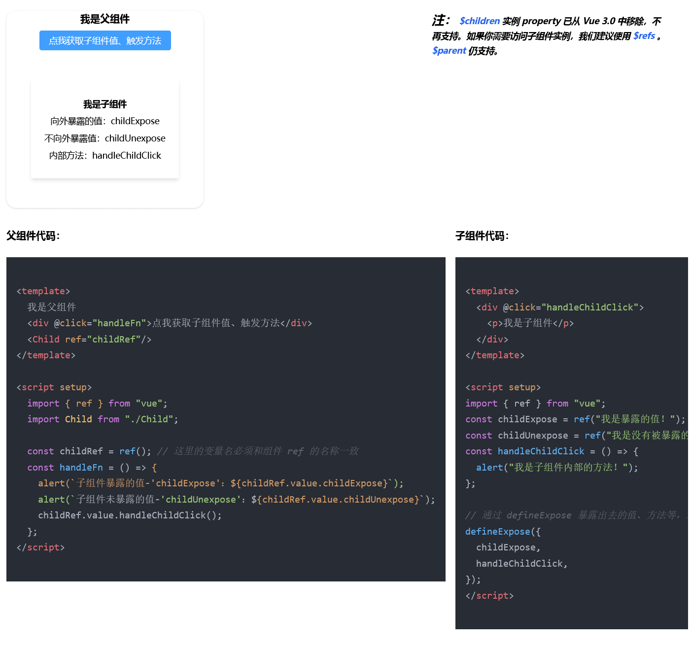

<p align="center">
  <a href="" rel="noopener">
  </a>
</p>

<h3 align="center">《vue3快速学习》</h3>

<div align="center">

[]()
[](/LICENSE)

</div>

## 🧐 这是什么 <a name = "about"></a>

这是一个 vue3 烹饪书，它有直接的示例和代码展示，你可以用它快速入门 vue3 的组合式 API。

示例中包含：Composition API（组合式 API）、vuex、vue-router、axios、tailwindcss，及一个单文件组件\<script setup>示例项目。

</a>

## 🏁 启动项目 <a name = "getting_started"></a>

```
git clone https://github.com/wangyupo/vue3-cookbook.git

cd vue3-cookbook

npm install

npm run serve
```

## 🥂 在线学习 <a name = "online"></a>

这里提供了本项目的 **[在线网页](https://wangyupo.github.io/vue3-cookbook-website)**，你可以直接点击它马上进入学习。

当然了，你也可以进入 vue 官方提供的 **[vue3.x 官方互动教程](https://cn.vuejs.org/tutorial/#step-1)**，跟随这个练习，在网页上练习一些基础内容。

## ⚠️ 注意事项 <a name = "notice"></a>

本项目仅针对有 vue 使用基础的人员，这些人员可以通过此项目快速、准确的上手 vue3.x 版本的新特性，并把它应用在你的项目中。

_本项目由 [v3s](https://github.com/wangyupo/v3s) 搭建，推荐使用 [v3s](https://github.com/wangyupo/v3s) ，结合 vsCode 插件 [V3S Snippets](https://github.com/wangyupo/V3S-Snippets) 编写快速、安全、标准的 vue3 代码。_

_如果你拥有 vue2 项目，那么建议去看看这个项目 [vue-vuex-router](https://github.com/wangyupo/vue-vuex-router)，它同时拥有 PC、Mobile 的快速开发能力。_
