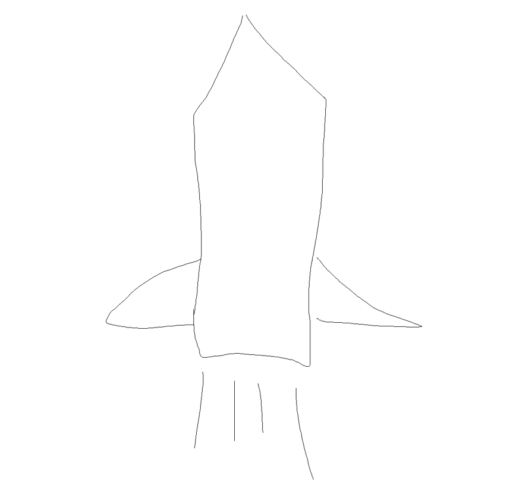

<p align="center">
  <a href="" rel="noopener">
 </a>
</p>

<h3 align="center">《vue3快速学习》</h3>

<div align="center">

  [](/LICENSE)

</div>

## 🧐 这是什么 <a name = "about"></a>
这是一个 vue3 烹饪书，它有直接的示例和代码展示，你可以用它快速入门 vue3 的组合式API。

示例中包含：Composition API（组合式 API）、vuex、vue-router、axios、tailwindcss，及一个单文件组件\<script setup>示例项目。

## 🏁 启动项目 <a name = "getting_started"></a>
```
git clone https://github.com/wangyupo/vue3-cookbook.git

cd vue3-cookbook

npm install

npm run serve
```

## ⚠️ 注意事项 <a name = "notice"></a>

本项目仅针对有 vue 使用基础的人员，这些人员可以通过此项目快速、准确的上手 vue3.x 版本的新特性，并把它应用在你的项目中。

**如果！** 你看不懂，又想入门vue，那就去看看这个项目 [vue-vuex-router](https://github.com/wangyupo/vue-vuex-router)，让它带你入门 vue。